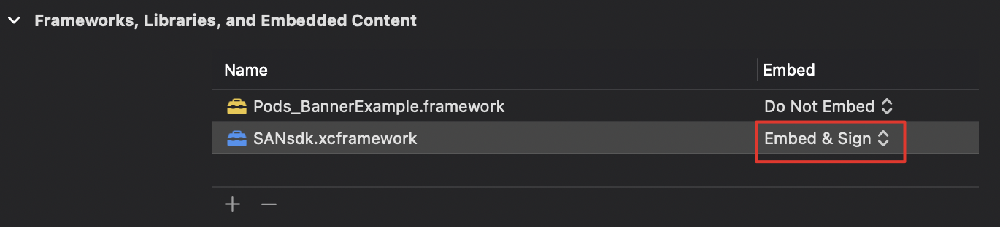

# SAN SDK Get Started (iOS)
## Prerequisites
- Use Xcode 12 or higher
- Target iOS 9.0 or higher
- Ask us for SDK framework, App ID and Placement ID

## Import the Mobile Ads SDK
1. unzip the SDK framework directly, and import the following frameworks into your Xcode project:
    - `SANsdk.xcframework`
    
      Please change embed option to “Embed & Sign”, like this:
          
    
2. Add the -ObjC linker flag to Other Linker Flags in your project's build settings:


## Update your Info.plist
Update your app's Info.plist file to add two keys:
1. A SANApplicationIdentifier key with a string value of your app ID (Ask us).
2. A SKAdNetworkItems key with SKAdNetworkIdentifier values for SAN (nfqy3847ph.skadnetwork)
   ```xml
    <key>SANApplicationIdentifier</key>
    <string>app-pub-demo-1000001</string>
    <key>SKAdNetworkItems</key>
    <array>
        <dict>
            <key>SKAdNetworkIdentifier</key>
            <string>nfqy3847ph.skadnetwork</string>
        </dict>
    </array>
   ```
## Initialize the Mobile Ads SDK
Before loading ads, call the `startWithCompletionHandler`: method on the `SANMobileAds.sharedInstance`, which initializes the SDK and calls back a completion handler once initialization is complete (or after a 30-second timeout). This only needs to be done once, ideally at app launch. You should call `startWithCompletionHandler`: as early as possible.

Here's an example of how to call the `startWithCompletionHandler`: method in your `AppDelegate`:
```objc
@import SANMobileAds;

@implementation AppDelegate

- (BOOL)application:(UIApplication *)application
didFinishLaunchingWithOptions:(NSDictionary *)launchOptions {
    [[SANMobileAds sharedInstance] startWithCompletionHandler:nil];
    return YES;
}

@end
```

## Select an ad format
The Mobile Ads SDK is now imported and initialized, and you're ready to implement an ad. SAN offers a number of different ad formats, so you can choose the one that best fits your app's user experience.

- ### Banner
Rectangular ads that appear at the top or bottom of the device screen. Banner ads stay on screen while users are interacting with the app, and can refresh automatically after a certain period of time. If you're new to mobile advertising, they're a great place to start.

- ### Native
Customizable ads that match the look and feel of your app. You decide how and where they're placed, so the layout is more consistent with your app's design.
